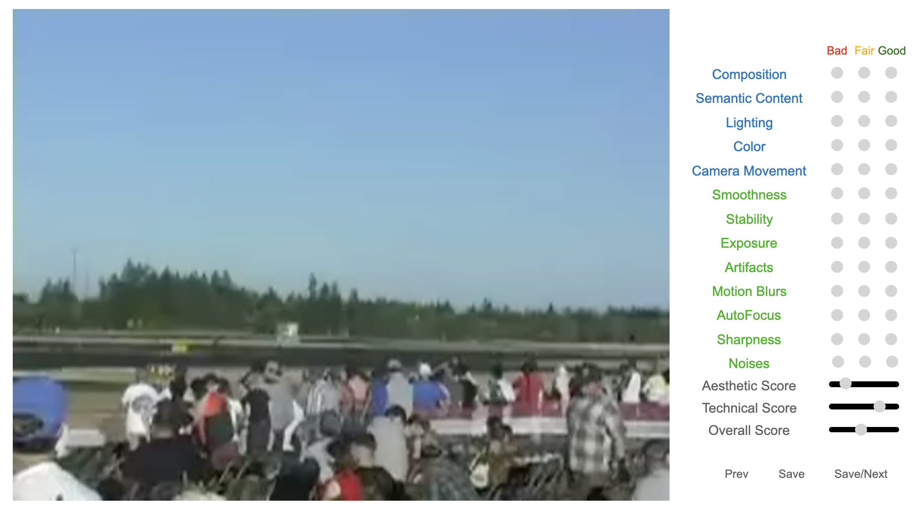

# Towards Explainable In-the-Wild Video Quality Assessment

A subjective study (Maxwell database) and a language-prompt approach (MaxVQA Model).

## Installation

Install and modify OpenCLIP:

```
git clone https://github.com/mlfoundations/open_clip.git
cd open_clip
sed -i '92s/return x\[0\]/return x/' src/open_clip/modified_resnet.py 
pip install -e .
```

Install DOVER for Pre-processing and FAST-VQA weights:

```
git clone https://github.com/vqassessment/DOVER.git
cd DOVER
pip install -e .
mkdir pretrained_weights 
cd pretrained_weights 
wget https://github.com/QualityAssessment/DOVER/releases/download/v0.1.0/DOVER.pth 
```

Return to MaxVQA.


## Usage

### Inference from Videos

### Inference from Features


## Maxwell Dataset for Explainable Quality Evaluation for In-the-wild Videos


