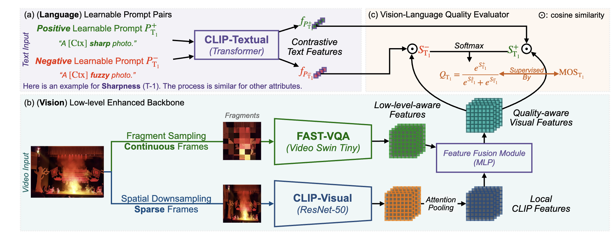

# *Towards* Explainable Video Quality Assessment

Official Repository for ACMMM 2023 Paper: "Towards Explainable in-the-wild Video Quality Assessment: a Database and a Language-prompt Approach." Paper Link: [Arxiv](https://arxiv.org/abs/2305.12726)

Dataset Link: [Huggingface](https://huggingface.co/datasets/teowu/MaxWell/resolve/main/videos.zip), [Baidu Pan](https://pan.baidu.com/s/1sScyTryyGHAJic8Z2P70nw?pwd=a2mb).

Welcome to visit Sibling Repositories from our team:

[FAST-VQA](https://github.com/vqassessment/FAST-VQA-and-FasterVQA)  ｜ [DOVER](https://github.com/vqassessment/DOVER)  ｜  [Zero-shot BVQI](https://github.com/vqassessment/BVQI)

The database (Maxwell, training part) has been released.


The code, demo and pre-trained weights of MaxVQA are released in this repo.



## Installation

Install and modify [OpenCLIP](https://github.com/mlfoundations/open_clip):

```
git clone https://github.com/mlfoundations/open_clip.git
cd open_clip
sed -i '92s/return x\[0\]/return x/' src/open_clip/modified_resnet.py 
pip install -e .
```

Install [DOVER](https://github.com/vqassessment/DOVER) for Pre-processing and FAST-VQA weights:

```
git clone https://github.com/vqassessment/DOVER.git
cd DOVER
pip install -e .
mkdir pretrained_weights 
cd pretrained_weights 
wget https://github.com/VQAssessment/DOVER/releases/download/v0.1.0/DOVER.pth 
```


## MaxVQA

### Gradio Demo

```python
demo_maxvqa.py
```

You can maintain a custom service for multi-dimensional VQA.


### Inference from Videos

```python
infer_from_videos.py
```

### Inference from Pre-extracted Features

```python
infer_from_feats.py
```

*For the first run, the script will extract features from videos.*


### Training on Mixed Existing VQA Databases

For the default setting, train on LIVE-VQC, KoNViD-1k, and YouTube-UGC.

```python
train_multi_existing.py -o LKY.yml
```

You can also modify the yaml file to include more datasets for training.

## Obtaining Data for the Maxwell Database

Will be added soon.

## Citation

Please feel free to cite our paper:

```bibtex
@article{wu2023maxvqa,
  title={Towards Explainable In-the-Wild Video Quality Assessment: a Database and a Language-Prompted Approach},
  author={Wu, Haoning and Zhang, Erli and Liao, Liang and Chen, Chaofeng and Hou, Jingwen and Wang, Annan  and Sun, Wenxiu and Yan, Qiong and Lin, Weisi},
  journal={Arxiv Preprint},
  year={2023}
}
```
